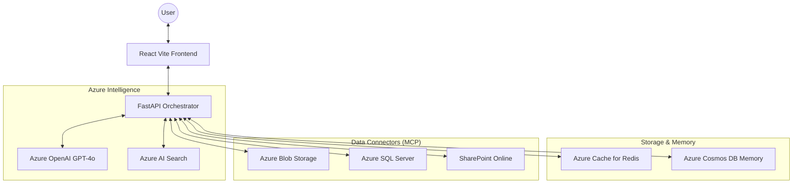

# 🤖 Azure Enterprise Agentic RAG Platform

[](https://azure.microsoft.com/)
[](https://vitejs.dev/)
[](https://fastapi.tiangolo.com/)

An enterprise-grade, multi-agentic Retrieval-Augmented Generation (RAG) platform built entirely on the **Azure Ecosystem**. This platform provides a unified interface for interacting with heterogeneous corporate data sources (SharePoint, SQL, Blob, Confluence) using advanced reasoning loops and real-time streaming.

---

## 🌟 Key Features

- **🧠 Agentic Reasoning (CoT)**: Real-time "Thinking" steps displayed via Chain-of-Thought processing, allowing users to see the agent's plan and tool selection.
- **🔌 Model Context Protocol (MCP)**: A modular connector architecture supporting:
  - **Azure AI Search**: Semantic and vector search.
  - **Azure Blob Storage**: Automated document indexing and retrieval.
  - **SQL Server**: Natural language to SQL querying.
  - **SharePoint & Confluence**: Direct enterprise knowledge connectors.
- **⚡ High-Performance Architecture**:
  - **Azure Cache for Redis**: Ultra-fast response caching to reduce LLM costs.
  - **Azure Cosmos DB (NoSQL)**: Permanent management of chat history and unstructured session memory.
- **💎 Premium UI/UX**: Built with Tailwind CSS v4 and React, featuring dark mode, glassmorphism, and responsive design.
- **🔐 Enterprise Security**: Integrated support for **Azure Managed Identity (Entra ID)** to eliminate the need for hardcoded API keys.

---

## 🏗️ Architecture Overview

The platform uses a "Plan-Execute-Synthesize" loop powered by Azure OpenAI.



---

## 🛠️ Local Installation

### Prerequisites
- Python 3.10+
- Node.js 18+
- Azure CLI (optional, but recommended for Entra ID auth)

### 1. Clone & Backend Setup
```bash
git clone https://github.com/Agentic_RAG_Azure.git
cd Agentic_RAG_Azure/backend

# Create virtual environment
python -m venv .venv
source .venv/bin/activate  # Windows: .venv\Scripts\activate

# Install dependencies
pip install -r requirements.txt
```

### 2. Frontend Setup
```bash
cd ../frontend
npm install
```

### 3. Configuration
Copy the `.env` template and fill in your Azure resources:
```bash
cp .env.example .env # Located in the backend folder
```

---

## 🚀 Azure Deployment

### Deployment Options
1. **Azure App Service**: Host the FastAPI backend and React frontend.
2. **Azure Static Web Apps**: Host the frontend for better performance.
3. **Azure Container Apps**: Ideal for microservices-based MCP connectors.

### Strategic Recommendations
- **Authentication**: Enable **System-Assigned Managed Identity** on the App Service.
- **Networking**: Use **Private Endpoints** for Redis and Cosmos DB for enterprise security.

---

## 📚 Documentation & Resources

- [Microsoft Azure AI Foundry Documentation](https://learn.microsoft.com/en-us/azure/ai-foundry/)
- [Model Context Protocol (MCP) Specification](https://modelcontextprotocol.io/)
- [Azure SDK for Python](https://learn.microsoft.com/en-us/azure/developer/python/sdk/azure-sdk-overview)
- [FastAPI Reference](https://fastapi.tiangolo.com/)

---

## 🤝 Contributing
Contributions are welcome! Please read the `CONTRIBUTING.md` (coming soon) for details on our code of conduct and the process for submitting pull requests.

## 📄 License
This project is licensed under the MIT License - see the `LICENSE` file for details.
