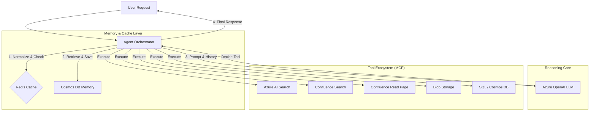
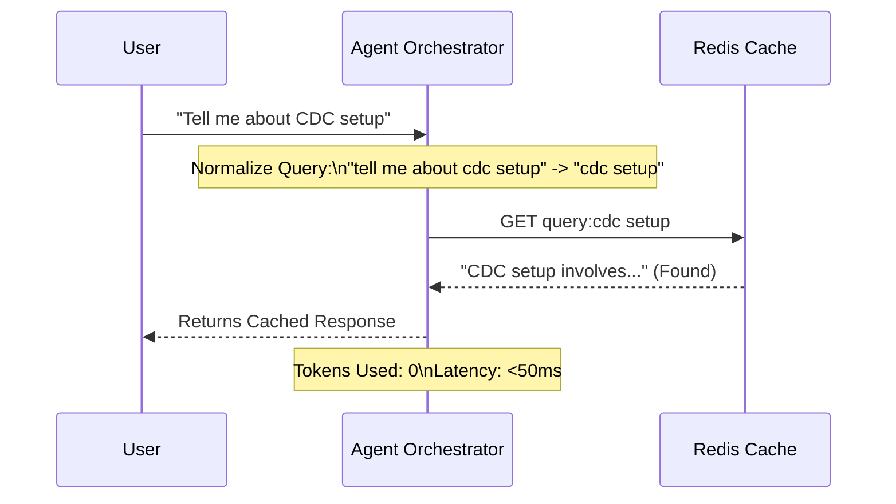
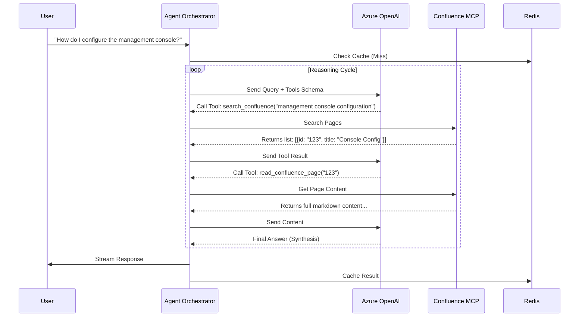
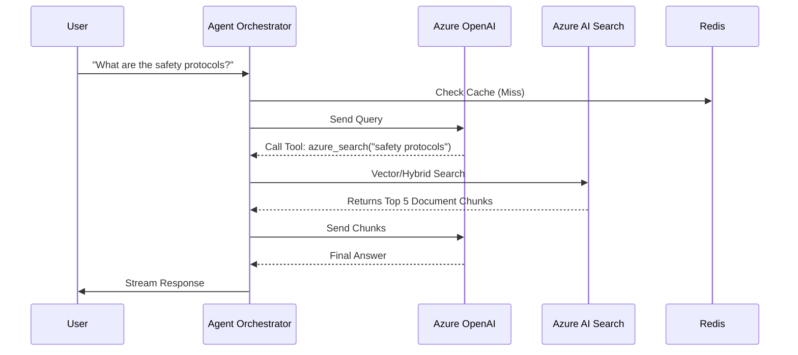
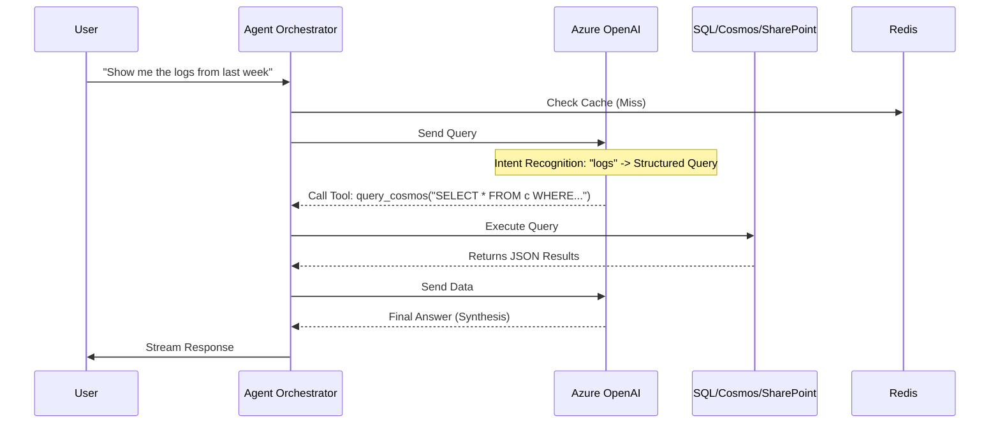
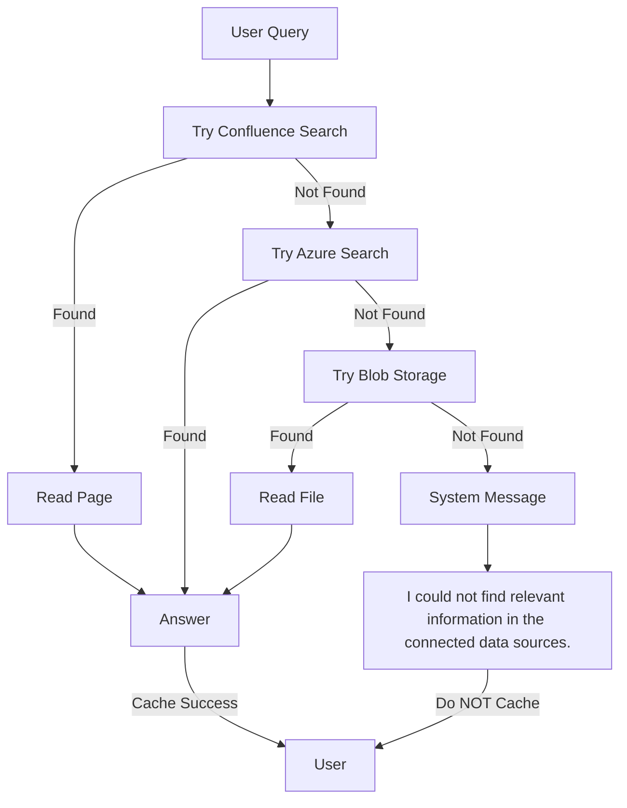

# Agentic RAG Azure - Workflow Documentation

This document outlines the operational flow of the Agentic RAG application, detailing how requests are processed, how caching works, and the decision logic for different data sources (Confluence, Azure Search, Blob Storage, etc.).

## 1. High-Level Architecture

The core of the system is the **Agent Orchestrator**, which manages state, caching, and tool execution.

---

## 2. Detailed Workflows

### Scenario A: Cache Hit (Fast Path)
*Optimized for latency and cost. Uses query normalization to handle "Tell me about X" vs "What is X".*

### Scenario B: Confluence Documentation Retrieval
*Multi-step reasoning loop to find and read internal docs.*

### Scenario C: General Knowledge / Semantic Search
*Standard RAG pattern using Azure AI Search.*

### Scenario D: Structured Data & External Systems (SQL, Cosmos, SharePoint)
*The Agent dynamically selects the correct tool based on the user's intent, supporting any new MCP server.*

### Scenario E: Multi-Source Fallback (Handling "Not Found")
*Ensures robust behavior when primary sources fail.*

## 3. Configuration & Optimization

The system implements 3 key optimizations:

1.  **Tool Output Pruning**:
    *   `search_confluence` returns minimized JSON (ID, Title, URL) instead of full payloads.
    *   *Benefit*: Saves ~90% of input tokens for search steps.

2.  **Context Management**:
    *   History truncation logic in `AgentOrchestrator` limits extremely long tool outputs from previous turns.
    *   *Benefit*: Prevents crashing context windows in long conversations.

3.  **Conditional Caching**:
    *   Only caches successful responses.
    *   Does NOT cache errors or "data not found" messages to prevent cache poisoning.
